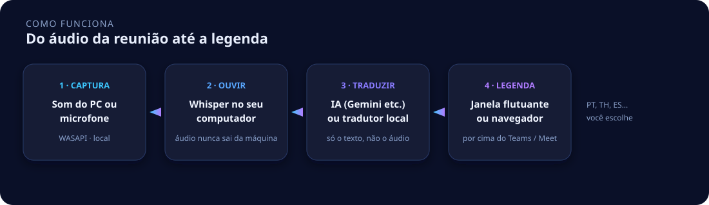
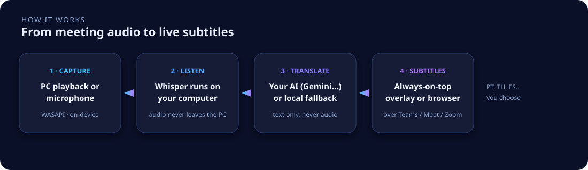

<p align="center">
  
</p>

<h1 align="center">WhisperBridge</h1>

<p align="center">
  <b>Legendas ao vivo para reuniões no Zoom, Microsoft Teams e Google Meet.</b><br>
  Transcreve o áudio do seu computador com Whisper <i>neste</i> PC e mostra a tradução numa janela por cima da chamada.
</p>

<p align="center">
  <a href="#português">Português</a> ·
  <a href="#english">English</a>
  &nbsp;·&nbsp;
  
  
  
  
</p>

<p align="center">
  
</p>

---

# Português

O **WhisperBridge** é um tradutor de reuniões em tempo real para Windows e Linux. Ele captura o **som do PC** (ou o microfone), transforma a fala em texto com **OpenAI Whisper rodando localmente** e exibe **legendas traduzidas** numa overlay always-on-top — em cima do Zoom, do Teams, do Google Meet, de um vídeo no YouTube ou de qualquer outro app.

Não é um plugin do Zoom. Não precisa de conta. O áudio da reunião **não vai para a nuvem**.

| O que ele faz | Como |
|---|---|
| Legendas ao vivo em qualquer reunião | Captura o som do PC (Teams, Zoom, Meet, YouTube) ou o microfone |
| Vários idiomas | Com IA (Gemini, Claude, GPT…): você escolhe o idioma da fala **e** o da legenda |
| Sem chave / sem internet | Tradução local só inglês → português |
| Overlay por cima de tudo | Janela flutuante ou a mesma UI no navegador |
| Privacidade | Transcrição 100% local. A nuvem, se usada, recebe **só texto** |

### Para quem é

- Daily, standup ou cliente em inglês, espanhol, francês… e você quer ler em português (ou o inverso).
- Quem assiste aula, webinar ou YouTube e precisa de **legenda instantânea**.
- Quem não pode mandar o **áudio** da empresa para um serviço de transcrição na nuvem.

### O que ele não é

Não substitui um intérprete humano em reunião jurídica ou médica crítica. Não envia o áudio para a OpenAI. Não instala extensão no Chrome do Meet — ele ouve o que o Windows já está tocando.

## Como funciona

<p align="center">
  
</p>

1. **Capturar** — escolhe *Som do PC* (o que está saindo no fone/caixa) ou *Microfone*.
2. **Ouvir** — o Whisper (`faster-whisper`) transcreve no seu computador, na GPU se houver NVIDIA, senão na CPU.
3. **Traduzir** — no modo **Recomendado (IA)** a Gemini/Claude/GPT traduz o par que você escolheu (inglês→português, português→tailandês, espanhol→japonês…). Sem IA, o modelo local cobre só inglês → português.
4. **Legendar** — a frase aparece na janela flutuante, por cima da reunião.

## O que você precisa

| | |
|---|---|
| Sistema | Windows 10/11 ou Linux (PulseAudio / PipeWire) |
| Python | **3.10, 3.11 ou 3.12** (3.13 não serve) |
| Node.js | LTS — só para montar a interface |
| GPU | NVIDIA ajuda bastante; sem placa também roda |
| Opcional | Rust — só se quiser a janela flutuante em vez do navegador |

## Instalar (o mais fácil)

**Windows** — depois do `git clone`, duplo clique em `Instalar.bat`

**Linux** — no terminal:

```bash
chmod +x install.sh scripts/linux/*.sh
./install.sh          # menu
# ou
./scripts/linux/doctor.sh           # só verifica
./scripts/linux/doctor.sh --fix     # instala o que falta
```

Ubuntu/Debian, se o PyAudio falhar:

```bash
sudo apt install python3.12 python3.12-venv python3.12-dev portaudio19-dev
```

No Linux, **Som do PC** usa o *monitor* do PulseAudio/PipeWire (`Monitor of …`). O microfone funciona igual.

O instalador pergunta o que fazer:

1. **Só verificar este PC** — RAM, GPU, Python, Node, o que falta e **quais modos você consegue usar**
2. **Instalar o que falta** (recomendado) — tenta Python/Node pelo `winget` e roda o setup
3. **Instalar + janela flutuante** — precisa de Rust
4. **Abrir o WhisperBridge agora**

Pelo terminal:

```powershell
git clone https://github.com/afborda/whisperbridge.git
cd whisperbridge
.\Instalar.bat                              # menu (duplo clique também)
.\scripts\windows\doctor.ps1                # só diagnóstico
.\scripts\windows\doctor.ps1 -Fix           # instala o que falta
```

O instalador cria o `.venv`, instala o PyTorch certo, compila a UI e gera o `.env`. É seguro rodar de novo.

```powershell
.\scripts\windows\setup.ps1 -Cpu         # força CPU
.\scripts\windows\setup.ps1 -Speakers    # + Pessoa 1 / Pessoa 2 (precisa de HF_TOKEN)
.\scripts\windows\setup.ps1 -Overlay     # + janela flutuante (precisa de Rust, ~10 min)
```

## Usar

```powershell
.\WhisperBridge.bat                          # overlay (ou navegador, se o exe não existir)
.\scripts\windows\start-browser.ps1          # só navegador
```

1. Toque a reunião ou o vídeo (ou fale no microfone).
2. Escolha **Som do PC** ou **Microfone**.
3. Clique em **Iniciar**.
4. No modo **Recomendado (IA)** (⚙): cole a chave (Gemini, Claude, GPT…) e escolha o idioma da fala e o da legenda.

Não feche com **✕** se quiser deixar o servidor rodando — use **minimizar**. O ✕ desliga o motor de propósito (libera a memória da placa).

Para matar um processo preso: `.\scripts\windows\stop.ps1`

## Modos

| Nome na tela | Quando usar |
|---|---|
| **Neste PC (rápido)** | Sem internet. Inglês → português neste computador. |
| **Recomendado (IA)** | Melhor tradução, qualquer par de idiomas. Cole a chave (Gemini, Claude, GPT…). |
| **IA sem placa de vídeo** | Quer liberar o jogo / outro app. Ouvir fica mais lento. |
| **Neste PC (sem internet)** | Sem placa e sem rede. Mais lento. |

Custo típico da IA no Gemini Flash-Lite: **cerca de US$ 0,02–0,04 por hora** de reunião. O áudio não é enviado.

## Chave da IA (opcional)

Não é obrigatória. Sem chave, o modo local já gera legendas **inglês → português**.
Com chave, o par é o que você escolher (incluindo Claude).

1. Abra **⚙ → Idiomas e chave da IA**
2. Escolha o idioma que estão falando e o da legenda
3. Gemini: [aistudio.google.com/apikey](https://aistudio.google.com/apikey)
4. Claude: cole a chave da Anthropic (o app fala a API oficial)
5. Ou GPT / DeepSeek: cole a chave + URL + modelo

A chave fica só na sua máquina (`user-settings.json` e `.env` — não vão para o Git).

## Privacidade

| Dado | Vai para a internet? |
|---|---|
| Áudio da reunião | **Não** |
| Texto transcrito (modo IA) | Sim, só o texto, para a API que você configurou |
| Sua chave | Só para o provedor que você escolheu |

## Perguntas frequentes

**Como traduzir uma reunião do Zoom, Teams ou Google Meet para português?**  
Abra o WhisperBridge, escolha *Som do PC*, clique em *Iniciar* e deixe a reunião tocando no fone. As legendas aparecem por cima da janela. Não precisa instalar nada no Zoom/Teams.

**Dá para traduzir de espanhol, francês, japonês… não só inglês?**  
Sim, no modo **Recomendado (IA)**. Em ⚙ você escolhe o idioma da fala e o da legenda. Claude, Gemini ou GPT traduzem o par. Sem IA, o tradutor local é só inglês → português.

**O WhisperBridge envia o áudio da reunião para a nuvem?**  
Não. A transcrição é local (Whisper). Se você ligar o modo IA, só o **texto** já transcrito vai para o Gemini/Claude/GPT que você configurou.

**Funciona sem internet?**  
Sim, nos modos *Neste PC*. A tradução fica em inglês → português no modelo local.

**Precisa de placa NVIDIA?**  
Não. Com placa fica bem mais rápido. Sem placa use *IA sem placa de vídeo* ou *Neste PC (sem internet)*.

**Dá para legendear YouTube, filme ou qualquer app?**  
Sim. Qualquer som que o Windows estiver tocando — o WhisperBridge ouve o loopback do sistema, não um site específico.

**Qual a diferença das legendas nativas do Zoom/Teams?**  
As nativas ficam presas naquele app, costumam mandar áudio para o provedor e você não escolhe o motor. O WhisperBridge funciona em qualquer janela, mantém o áudio no PC e usa a IA que você quiser.

## Estrutura

```
whisperbridge/
├── Instalar.bat / WhisperBridge.bat / install.sh   atalhos da raiz
├── run_server.py                                   python -m whisperbridge
├── src/whisperbridge/                              motor (áudio, VAD, Whisper, tradução)
│   ├── server.py                                   FastAPI + WebSocket
│   └── config/                                     portas, perfis, preferências
├── scripts/windows/  scripts/linux/                doctor, setup, launcher
├── requirements/                                   windows.txt · linux.txt
├── apps/desktop/                                   React + Tauri (overlay)
└── assets/                                         ícone e imagens do README
```

---

# English

**Live subtitles for Zoom, Microsoft Teams and Google Meet** — on your Windows or Linux machine.

WhisperBridge captures **system audio** (or the microphone), transcribes speech **on-device** with Whisper, and shows a translation overlay on top of the call. It is not a Zoom plugin. Meeting audio **never leaves the PC**.

- Daily standups and client calls in a language you only half-follow
- Any spoken / subtitle pair with Gemini, Claude or GPT (local-only is English → Portuguese)
- Lectures, webinars, YouTube — anything the computer is already playing
- Teams that cannot send call audio to a cloud transcription API

<p align="center">
  
</p>

1. **Capture** — *PC sound* (loopback) or *Microphone*.
2. **Listen** — `faster-whisper` runs on your GPU or CPU. Audio stays here.
3. **Translate** — local English → Portuguese, or your Gemini / Claude / GPT key for any language pair. **Text only** goes to the network.
4. **Subtitle** — always-on-top overlay, or the same UI in the browser. You pick spoken and subtitle languages.

## Requirements

| | |
|---|---|
| OS | Windows 10/11 or Linux (Pulse/PipeWire) |
| Python | **3.10–3.12** (3.13 is not supported) |
| Node.js | LTS |
| GPU | NVIDIA recommended; CPU-only works, slower |
| Optional | Rust — only for the floating overlay |

## Install (easiest)

**Windows** — after `git clone`, double-click `Instalar.bat`

**Linux:**

```bash
chmod +x install.sh scripts/linux/*.sh
./install.sh
# or
./scripts/linux/doctor.sh           # check only
./scripts/linux/doctor.sh --fix     # install missing pieces
./scripts/linux/start-browser.sh    # run
```

If PyAudio fails on Ubuntu/Debian:

```bash
sudo apt install python3.12 python3.12-venv python3.12-dev portaudio19-dev
```

On Linux, **PC sound** uses the PulseAudio/PipeWire *monitor* device. Microphone works the same.

From a terminal:

```powershell
git clone https://github.com/afborda/whisperbridge.git
cd whisperbridge
.\Instalar.bat
.\scripts\windows\doctor.ps1 -Fix
```

```powershell
.\scripts\windows\setup.ps1 -Cpu         # force CPU
.\scripts\windows\setup.ps1 -Speakers    # + speaker labels (needs HF_TOKEN)
.\scripts\windows\setup.ps1 -Overlay     # + floating window (needs Rust)
```

## Run

```powershell
.\WhisperBridge.bat
.\scripts\windows\start-browser.ps1
```

1. Play a meeting or video (or speak into the mic).
2. Pick **PC sound** or **Microphone**.
3. Click **Start**.
4. In **Recommended (AI)**: paste your key and set languages.

Don’t use **✕** if you want the engine to keep running — **minimize**. ✕ frees GPU memory on purpose.

Stuck process: `.\scripts\windows\stop.ps1`

## Modes

| On-screen name | Use when |
|---|---|
| **On this PC (fast)** | Offline. English → Portuguese on this computer. |
| **Recommended (AI)** | Best translation. You paste a key and pick languages. |
| **AI without GPU** | Free the graphics card for a game / other app. Listening is slower. |
| **On this PC (offline)** | No GPU, no internet. Slowest. |

Typical Gemini Flash-Lite cost: **about US$ 0.02–0.04 per hour**. Audio is not uploaded.

## Privacy

| Data | Leaves the PC? |
|---|---|
| Meeting audio | **No** |
| Transcript text (AI mode) | Yes, text only, to the API you configured |
| Your API key | Only to the provider you chose |

## FAQ

**How do I get live Portuguese subtitles on a Zoom / Teams / Meet call?**  
Start WhisperBridge, pick *PC sound*, click *Start*, and leave the meeting playing. No browser extension, no Zoom marketplace app.

**Does it upload meeting audio?**  
No. Whisper runs locally. Cloud mode sends **text**, never audio.

**Does it work offline?**  
Yes, in the *On this PC* modes (English → Portuguese).

**YouTube, movies, any window?**  
Yes. It listens to the system loopback, not a specific website.

## License

[MIT](LICENSE)
